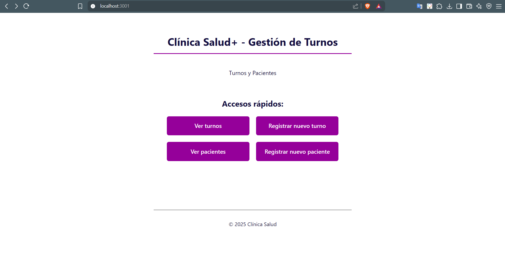
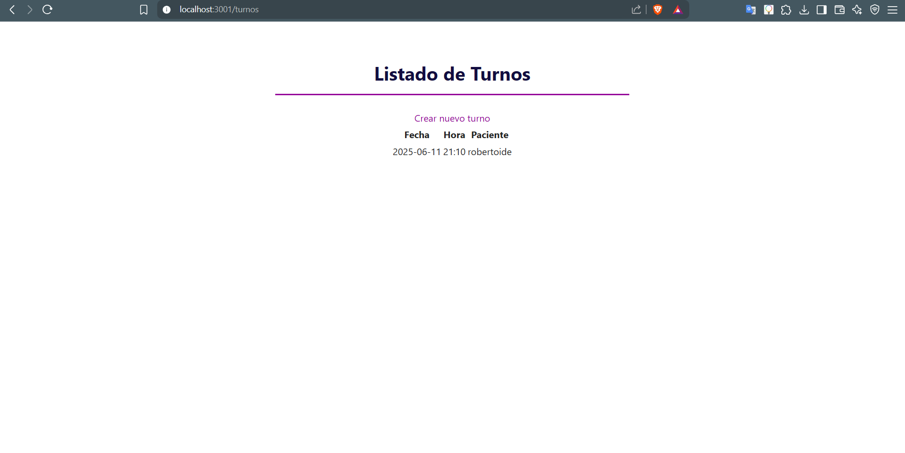
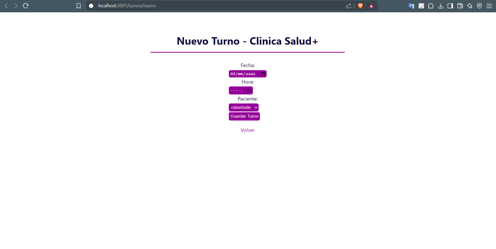
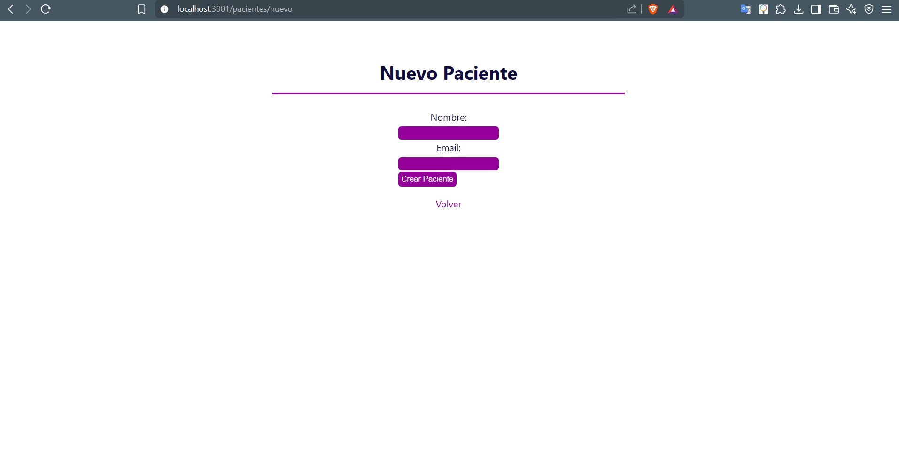

# 🏥 TP3 - Clínica Salud+ (Programación III)

Aplicación web para la gestión de turnos médicos.  
Desarrollado como Trabajo Práctico 3 para la materia **Programación III**.

---

## 📦 Instalación

Clonar el repositorio:
   ```bash
   git clone https://github.com/ifregeiro/ProgramacionIII-TP.git
   cd ProgramacionIII-TP/TP3
   ```

Instalar dependencias:
   ```bash
   npm install
   ```

Crear el archivo `.env` en la raíz del proyecto:
   ```env
   PORT=3000
   TEMPLATE=ejs
   HOST=http://localhost
   ```

Iniciar el servidor:
   ```bash
   node --watch ./src/index.js
   ```

---

## 🌐 Endpoints y Funcionalidades

| Versión        | Método | Endpoint                        | Descripción                                             |
|----------------|--------|----------------------------------|---------------------------|
| **Base** | -    | localhost:3001             |     Entrar a la      web                                |
| **Online API** | GET    | `/api/v1/pacientes`             | Listar todos los pacientes (JSON)                                             |
| **Online API** | POST   | `/api/v1/pacientes`             | Crear un nuevo paciente (JSON)                                               |
| **Online API** | DELETE | `/api/v1/pacientes/:id`         | Eliminar un paciente por su ID                                                |
| **Online API** | GET    | `/api/v1/turnos/:idPaciente`    | Obtener los turnos de un paciente                                          
| **Online API** | POST   | `/api/v1/turnos`                | Registrar un nuevo turno                               
| **Online API** | DELETE | `/api/v1/turnos/:idTurno`       | Cancelar un turno                                      |
| **Local (EJS)**| GET    | `/`                             | Página de inicio (menú principal)                      |
| **Local (EJS)**| GET    | `/pacientes`                    | Listar pacientes desde vista renderizada               | 
| **Local (EJS)**| GET    | `/turnos`                       | Ver listado de turnos desde vista renderizada          | 
| **Local (EJS)**| GET    | `/turnos/nuevo`                 | Formulario para registrar nuevo turno                  | 
| **Local (EJS)**| POST   | `/pacientes/nuevo`                       | Crear usuario del  nuevo paciente               | 
                   

---

## 📁 Estructura Proyecto

```
src/
├── index.js
├── server.js
├── .env.template
├── models/
│   └── sqlite/
│       ├── config/db.js
│       └── entities/
│           ├── paciente.entity.js
│           └── turno.entity.js
├── routes/
│   ├── home.routes.js
│   ├── pacientes.route.js
│   └── turnos.route.js
├── controllers/
│   ├── pacientes.local.controller.js
│   └── turnos.local.controller.js
└─── views/
     └── ejs/
          ├── index.ejs
          ├── turnos/
          │       ├── lista.ejs
          │       └── nuevo.ejs
          └── pacientes/
                  ├── lista.ejs
                  └── nuevo.ejs
```

---

## 👥 Integrantes

- Sola, Lucia
- Bascuñán, Xabier
- Severino, Tomás Andrés
- Fregeiro, Ignacio Agustín

---

## 📸 Capturas de pantalla

__
__
__
__

---
