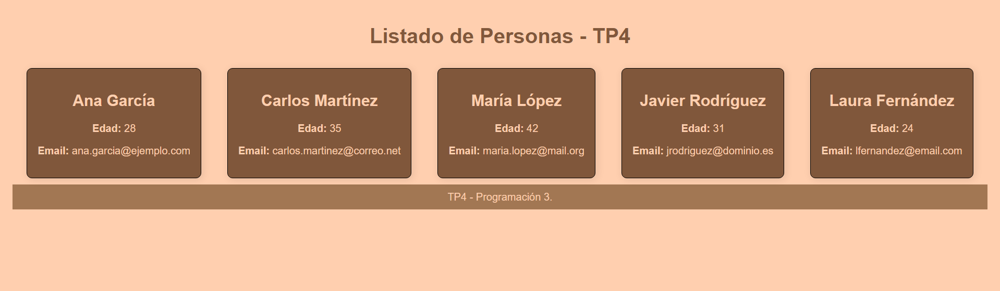

# TP4 - React + Express

Este proyecto es parte del Trabajo Práctico Nº4 de la materia **Programación 3**. El objetivo es crear una aplicación web completa con **frontend en React** y **backend en Express**, consumiendo una API REST para mostrar un listado de personas.

## 🚀 Tecnologías

- **Backend**: Node.js, Express, CORS
- **Frontend**: React, Vite
- **Estilo**: CSS clásico (con posibilidad de usar Tailwind o Bootstrap)

## 📦 Instalación

### 1. Instalar dependencias

#### Backend
```bash
cd backend
npm install
```

#### Frontend
```bash
cd ../frontend
npm install
```

## 🧪 Uso

### Iniciar backend

Desde la carpeta `backend`:

```bash
npm run dev
```

Servidor disponible en `http://localhost:3000`.

Endpoint disponible: `GET /personas`.

### Iniciar frontend

Desde la carpeta `frontend`:

```bash
npm run dev
```

Abrir en navegador: `http://localhost:5173` (Vite te lo indicará).

## 📌 Autor

- ✍️ Trabajo Práctico 4 - **Programación 3**
- 💼 Alumnos: Sola Lucia, Bascuñán Xabier, Severino Tomás Andrés, Fregeiro Ignacio Agustín.

---

## 📸 Captura de pantalla


